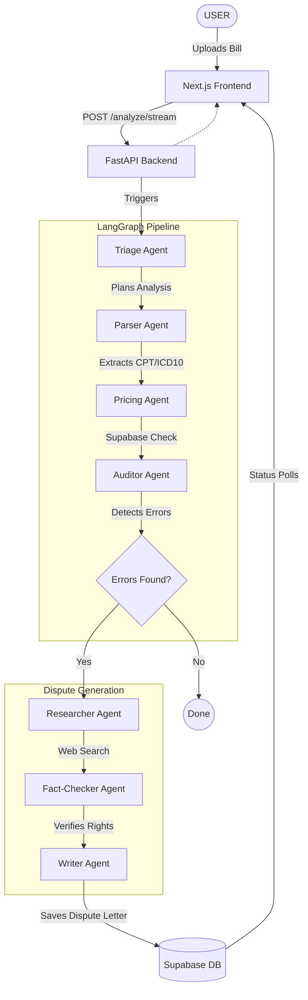

# FairMed

Multi-agent AI system that analyzes medical bills, detects billing errors (duplicates, upcoding, unbundling, overcharges), compares against Medicare fair pricing, and generates a ready-to-send dispute letter.

**NVIDIA Agents for Impact Hackathon | SJSU | March 2026**


## Architecture

7 agents orchestrated by LangGraph:



## Models

- **NVIDIA Nemotron Super 120B** — reasoning agents (Triage, Auditor, Fact-Checker, Writer)
- **NVIDIA Nemotron Nano 30B** — available for tool-calling tasks

## Data Sources

- **CMS RVU26B April 2026** Medicare Physician Fee Schedule (real rates)
- **CMS NCCI Quarterly PTP Edits** (unbundling rules)
- **CMS NCCI MUE Limits** (max units per service)
- **ICD10API.com** (diagnosis code validation)
- **DuckDuckGo Search** (patient rights research)

## Project Structure

```
billshield/
├── app/                  # Next.js 15 App router (UI)
├── components/           # React component library
├── agents/               # Python LangGraph agents
├── tools/                # DB clients and Web Search tools
├── prompts/              # System Prompts for agents
├── server.py             # FastAPI backend entrypoint (REST+SSE)
├── fetch_ncci_latest.py  # CMS data ingestion script
└── next.config.ts        # Rewrites /api to FastAPI
```

## Tech Stack

| Layer | Technology |
|-------|-----------|
| Frontend | Next.js 15, React 19, Tailwind CSS |
| Backend | FastAPI (Python) |
| LLM | NVIDIA Nemotron via NIM API |
| Agent Framework | LangGraph (StateGraph) |
| Database | Supabase (PostgreSQL) |
| Deployment | Vercel (Services API) |

## Deploy on Vercel

This project uses Vercel's Services API with two services:
- `frontend/` - Next.js app (route prefix: `/`)
- `backend/` - FastAPI (route prefix: `/api`)

Set these environment variables in Vercel:
- `NVIDIA_API_KEYS` - Your NVIDIA NIM API keys
- `SUPABASE_URL` - Supabase project URL
- `SUPABASE_KEY` - Supabase anon key
